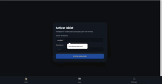

# SmartMenu - Frontend

Sistema de gestión de pedidos y carta digital inteligente para restauración. Este repositorio contiene la aplicación cliente desarrollada en Angular.

## 

## 🚀 Inicio Rápido

1. **Instalar dependencias:**

   ````bash
   npm install```

   ````

2. **Lanzar servidor de desarrollo:**

`bash ng serve`

Accede a http://localhost:4200 en tu navegador.

---

## Documentación Técnica

Hemos documentado la arquitectura, las interfaces y los servicios utilizando **TypeDoc**.

Para generar y ver la documentación técnica detallada, ejecuta:

**npm run generate-docs**

> **Nota:** Una vez finalizado el comando, abre el archivo ./docs/index.html en tu navegador.

## Tecnologías Utilizadas

- **Angular 20**
- **TypeDoc**
- **CSS**

## 🔗 Guía de Integración

Para Backend, por favor consultad el archivo INTEGRATION.md para detalles sobre los Endpoints, modelos JSON y seguridad JWT.
